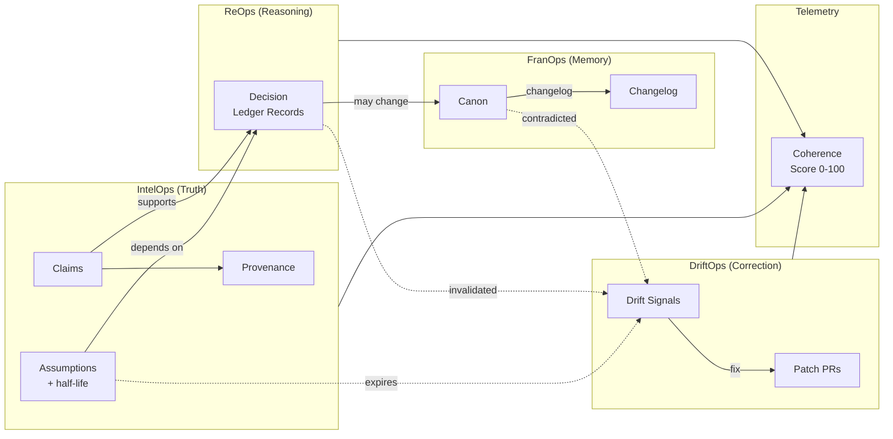

# CoherenceOps

**Coherence is infrastructure, not culture.**

[](coherence/telemetry/coherence_score.json)

GitHub-native governance for any repo. Track truth, record reasoning, protect memory, detect drift, ship patches.

---

## What Is This?

CoherenceOps is a folder-and-template system that turns your GitHub repo into a governed decision surface. No SaaS, no agents, no vendor lock-in. Just Markdown, YAML, and the workflows you already use.

It implements four modules:

| Module | Folder | Purpose |
|--------|--------|---------|
| **IntelOps** (Truth) | `coherence/intel/` | Claims, assumptions, provenance — what you believe and why |
| **ReOps** (Reasoning) | `coherence/decisions/` | Decision Ledger Records — what you decided and what you traded off |
| **FranOps** (Memory) | `coherence/canon/` | Canon — mission, architecture, commitments that outlive any individual |
| **DriftOps** (Correction) | `coherence/drift/` | Drift signals and patch PRs — what changed and how you fixed it |

Plus a **telemetry** surface (`coherence/telemetry/`) for scoring coherence health.



## Why?

Ask yourself: **If your lead left tomorrow, could a new person answer "why did we build it this way?" in under 60 seconds?**

If not, you have a coherence problem. Decisions live in Slack threads, assumptions rot in stale docs, architectural commitments exist only in someone's head. When that person leaves, institutional memory leaves with them.

CoherenceOps makes the invisible visible — and keeps it current.

## Automation Boundaries

CoherenceOps is built to govern high-consequence decisions, not to claim universal automation.

- Coding is a constrained sandbox: deterministic syntax, fixed rules, fast compiler feedback.
- Real organizational work is not: strategy, operations, and negotiation depend on context, judgment, and human trade-offs.
- AI can accelerate code generation and workflow mechanics, but acceleration is not authority.
- CoherenceOps treats AI outputs as inputs to governance, not substitutes for engineering or leadership.

Practical distinction:
- `coding`: syntax translation and implementation speed
- `engineering`: problem framing, ambiguity handling, legacy constraints, stakeholder alignment, risk ownership

CoherenceOps is designed to protect the second category while making the first category faster and auditable.

## How to Adopt

### Option A: Copy the folder
```bash
cp -r coherence/ /path/to/your-repo/coherence/
cp -r .github/ /path/to/your-repo/.github/
```

### Option B: Git submodule
```bash
git submodule add https://github.com/ORG/CoherenceOps.git coherence-ops
```

### Option C: Use as a template
Click **Use this template** on GitHub to create a new repo with the full structure.

### Option D: Run `coherence-init`
```bash
git clone https://github.com/8ryanWh1t3/CoherenceOps.git /tmp/coherence-ops
/tmp/coherence-ops/bin/coherence-init .
```
Bootstraps the full `coherence/` folder, templates, and labels into your existing repo. Zero dependencies.

### Option E: Use the composite action

```yaml
# In your .github/workflows/coherence.yml
- uses: 8ryanWh1t3/CoherenceOps/actions/check@v0.4.2
  with:
    coherence_root: coherence  # default
```
Pin to a tag (`@v0.4.2`), branch (`@main`), or commit SHA for stability.

See [docs/CI_INSTALLATION.md](docs/CI_INSTALLATION.md) for the full installation contract (permissions, labels, branch protection).

## Demo Workflow (6 Steps)

1. **Developer opens a PR** that changes core architecture
2. **PR template asks**: DLR link? Assumptions touched? Canon impact?
3. **Developer creates a DLR** via the one-click link in `coherence/decisions/README.md`
4. **Reviewer verifies** the DLR covers trade-offs, blast radius, and rollback
5. **PR merges** — the decision is sealed in version control forever
6. **Three months later**, an assumption expires. A **Drift** signal opens. A **Patch PR** resolves it.

That's the loop: **Decide → Seal → Drift → Patch → Repeat.**

## Quick Links

| Resource | Link |
|----------|------|
| 1-Page Quick Start | [docs/QUICKSTART_1PAGE.md](docs/QUICKSTART_1PAGE.md) |
| Swim Lane Diagram | [docs/SWIMLANE.md](docs/SWIMLANE.md) |
| 10-Min Demo | [docs/DEMO_DRIFT_TO_PATCH.md](docs/DEMO_DRIFT_TO_PATCH.md) |
| Gate Test Playbook | [docs/GATE_TEST_PLAYBOOK.md](docs/GATE_TEST_PLAYBOOK.md) |
| Executive Health Guide | [docs/EXECUTIVE_README.md](docs/EXECUTIVE_README.md) |
| Adoption Checklist | [docs/ADOPTION_CHECKLIST.md](docs/ADOPTION_CHECKLIST.md) |
| Principles | [docs/PRINCIPLES.md](docs/PRINCIPLES.md) |
| Glossary | [docs/GLOSSARY.md](docs/GLOSSARY.md) |
| 30-Min Training Outline | [docs/TRAINING_30MIN_OUTLINE.md](docs/TRAINING_30MIN_OUTLINE.md) |
| CI Installation Contract | [docs/CI_INSTALLATION.md](docs/CI_INSTALLATION.md) |
| Runtime Governance Engineering (Part I) | [docs/RUNTIME_GOVERNANCE_ENGINEERING.md](docs/RUNTIME_GOVERNANCE_ENGINEERING.md) |

## What's a "Major PR"?

A PR is **major** (and requires a DLR) if any of these are true:

- It has the `major` label
- It changes more than 10 files
- It touches `coherence/canon/`, `coherence/intel/`, or core architecture folders

Everything else is a normal PR. No overhead.

## Scoring

CoherenceOps defines a simple **Coherence Score** (0-100) based on:

- DLR coverage for major PRs
- Expired assumption count
- Open drift signal count
- Median "why retrieval" time

See [actions/COHERENCE_SCORE_SPEC.md](actions/COHERENCE_SCORE_SPEC.md) for the formula.

## Run Dashboards Against Sample Packs

CoherenceOps ships with sample data packs for demos, training, and stress-testing. Run any dashboard against sample data without copying files:

**Locally:**

```bash
COHERENCE_ROOT=sample_data/game_studio_aaa bin/coherence-check
```

**Via GitHub Actions (workflow_dispatch):**

Go to **Actions** > select a workflow (e.g., Coherence Weekly Rollup) > **Run workflow** > set `coherence_root` to `sample_data/game_studio_aaa`.

Outputs are written to `telemetry_out/` (never into the sample pack). See [docs/SAMPLE_MODE.md](docs/SAMPLE_MODE.md) for details.

## License

[MIT](LICENSE)

## Version

v0.4.2 — See [CHANGELOG.md](CHANGELOG.md)
