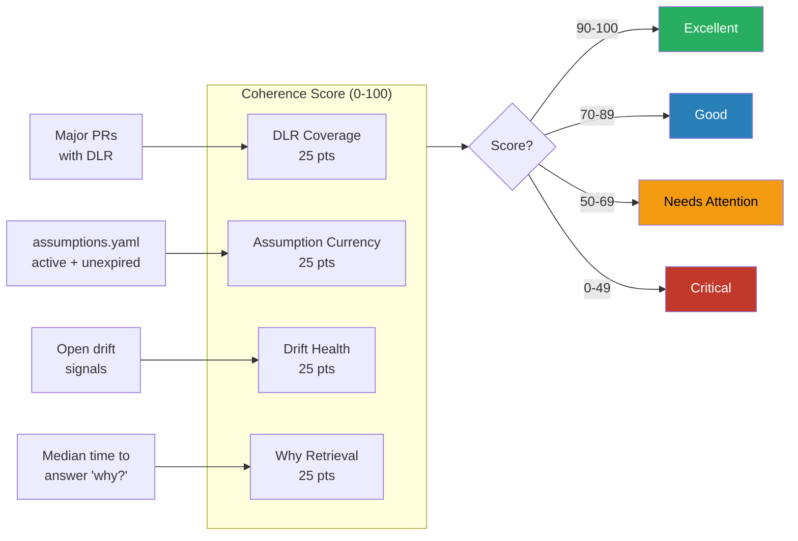

# Coherence Score Specification

## Overview

The Coherence Score is a single number (0-100) that measures the health of a repo's governance infrastructure. It answers: **"How well does this repo know why it was built this way?"**

## Formula

```
score = dlr_coverage_pts + assumption_currency_pts + drift_health_pts + why_retrieval_pts
```

Each component contributes up to 25 points. Maximum score: 100.



## Components

### 1. DLR Coverage (25 pts)

How many major PRs have a linked DLR?

```
coverage = major_prs_with_dlr / total_major_prs
dlr_coverage_pts = round(coverage * 25)
```

- If `total_major_prs == 0`, score is 25 (no major PRs = no obligation)
- "Major PR" definition: label `major`, or 10+ files, or touches canon/intel/architecture

### 2. Assumption Currency (25 pts)

How many active assumptions are still valid (not expired)?

```
currency = active_unexpired / total_active
assumption_currency_pts = round(currency * 25)
```

- If `total_active == 0`, score is 25 (no assumptions = no expiry risk)
- Assumptions with `status: retired` or `status: validated` are excluded

### 3. Drift Health (25 pts)

How many drift signals are open?

```
penalty = open_drift_count * 5
drift_health_pts = max(0, 25 - penalty)
```

- 0 open drifts = 25 pts
- 1 open drift = 20 pts
- 5+ open drifts = 0 pts
- Only `status: open` drifts count; `patched` and `wont-fix` are excluded

### 4. Why Retrieval (25 pts)

Median time for a new person to find "why was this built this way?"

```
why_retrieval_pts = max(0, 25 - round(median_seconds / 4))
```

- 0 seconds = 25 pts (perfect)
- 60 seconds = 10 pts (target)
- 100+ seconds = 0 pts
- Measurement: manual for v0.1 (time a new team member; use stopwatch)
- Future: automated via IRIS-style query timing

## Interpretation

| Score | Rating | Action |
|-------|--------|--------|
| 90-100 | Excellent | Maintain current practices |
| 70-89 | Good | Address any expired assumptions or open drifts |
| 50-69 | Needs Attention | Review DLR coverage, schedule drift triage |
| 0-49 | Critical | Governance infrastructure needs immediate investment |

## Measurement Cadence

- **v0.1:** Manual, monthly. Update `coherence/telemetry/coherence_score.json`.
- **v0.2+:** Automated via GitHub Actions on weekly schedule.

## Changelog

| Date | Change |
|------|--------|
| 2026-02-20 | Initial specification (v0.1.0) |
