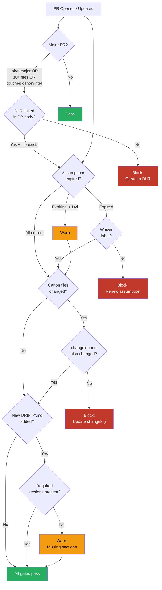

# Policy Logic (CI Gates)

Checks to enforce via GitHub Actions. This document defines the rules; implementation is planned for v0.2.0.

## Gate 1: Major PR Requires DLR

**Trigger:** PR opened or updated

**Condition:** PR is "major" if ANY of:
- PR has the `major` label
- PR changes more than 10 files
- PR modifies files in `coherence/canon/`, `coherence/intel/`, or paths listed in a configurable `ARCHITECTURE_PATHS` variable

**Check:**
- Scan PR body for a DLR link matching pattern `coherence/decisions/DLR-\d{4}.md`
- Verify the linked DLR file exists in the branch

**Result:**
- **Pass:** DLR found and file exists
- **Fail:** Block merge with message: *"This is a major PR. Create a DLR in coherence/decisions/ and link it in the PR description."*

## Gate 2: Assumption Expiry Warning

**Trigger:** PR opened, or scheduled weekly

**Check:**
- Parse `coherence/intel/assumptions.yaml`
- For each assumption with `status: active`, compare `expires` to today

**Result:**
- **Warning** (non-blocking): Assumption expires within 14 days
- **Fail** (blocking): Assumption has expired (`expires < today` and `status: active`)
- **Pass:** All assumptions current

**Override:** Add label `assumption-waiver` to bypass expired assumption block (with required justification comment).

## Gate 3: Canon Changelog Required

**Trigger:** PR opened or updated

**Condition:** PR modifies any file in `coherence/canon/` other than `changelog.md`

**Check:**
- Verify `coherence/canon/changelog.md` is also modified in the same PR

**Result:**
- **Pass:** Changelog updated
- **Fail:** Block merge with message: *"Canon changed without a changelog entry. Update coherence/canon/changelog.md."*

## Gate 4: Drift Signal Format

**Trigger:** PR adds a file matching `coherence/drift/DRIFT-*.md`

**Check:**
- File contains required headings: Severity, What Drifted, Evidence, Affected, Status
- Severity is one of: low, medium, critical

**Result:**
- **Pass:** Well-formed drift signal
- **Warning:** Missing sections (non-blocking, advisory)

## Implementation Notes

- All gates run as GitHub Actions workflow steps
- Gates should be fast (< 10 seconds each)
- Use `actions/github-script` for label/file checks
- Parse YAML with a lightweight action or inline script
- Policy configuration lives in a `.coherenceops.yml` at repo root (future)
