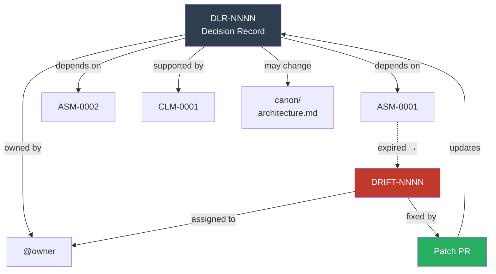

# ReOps (Reasoning)

Decision Ledger Records — what was decided, why, and what was traded off.

## Files

| File | Purpose |
|------|---------|
| [DLR_TEMPLATE.md](DLR_TEMPLATE.md) | Template for new decision records |
| [DLR-0001.md](DLR-0001.md) | Seed DLR: adopt CoherenceOps folder structure |

## Create a New DLR

> Replace `ORG` and `REPO` with your GitHub org and repo name.

[Create New DLR](https://github.com/ORG/REPO/new/main/coherence/decisions?filename=DLR-YYYYMMDD-001.md&value=%23%20DLR-YYYYMMDD-001%3A%20%5BTitle%5D%0A%0A%23%23%20Status%0ADraft%20%7C%20Proposed%20%7C%20Accepted%20%7C%20Superseded%0A%0A%23%23%20Context%0AWhat%20problem%20are%20we%20solving%3F%0A%0A%23%23%20Options%20Considered%0A1.%20...%0A2.%20...%0A%0A%23%23%20Decision%0AWhat%20we%20chose%20and%20why.%0A%0A%23%23%20Trade-offs%0AWhat%20we%20gave%20up.%0A%0A%23%23%20Assumptions%0A-%20ASM-NNNN%0A%0A%23%23%20Blast%20Radius%0AScope%20of%20impact%20if%20wrong.%0A%0A%23%23%20Rollback%0AHow%20to%20reverse%20this.%0A%0A%23%23%20Owner%0A%40handle%0A%0A%23%23%20Date%0AYYYY-MM-DD)

Steps:
1. Click the link above
2. Replace `NNNN` with the next number or use date-based ID (e.g. `DLR-20260220-001`)
3. Fill in each section
4. Commit to your feature branch
5. Reference the DLR path in your PR description

## DLR Traceability

## Rules

- Major PRs require a DLR before merge
- Every DLR must name an Owner
- Every DLR must reference assumptions (by ASM-ID) it depends on
- When an assumption expires, the DLR owner is notified via drift signal
