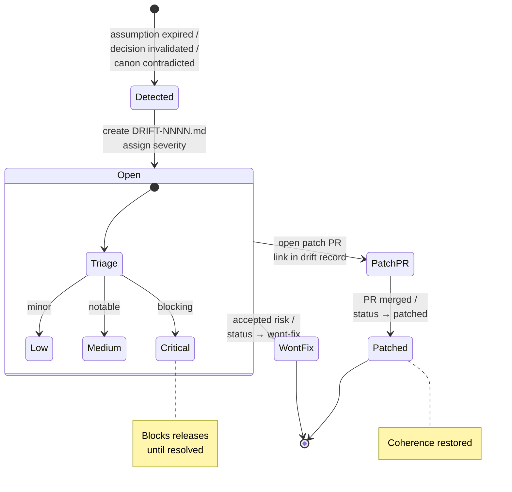

# DriftOps (Correction)

Drift signals and patch tracking. When reality diverges from a recorded decision, assumption, or canon entry — this is where it gets logged and fixed.

## Files

| File | Purpose |
|------|---------|
| [DRIFT_TEMPLATE.md](DRIFT_TEMPLATE.md) | Template for new drift signals |
| [DRIFT-0001.md](DRIFT-0001.md) | Seed drift signal |

## Create a New Drift Signal

> Replace `ORG` and `REPO` with your GitHub org and repo name.

[Create New Drift Signal](https://github.com/ORG/REPO/new/main/coherence/drift/?filename=DRIFT-NNNN.md&value=%23%20DRIFT-NNNN%3A%20%5BTitle%5D%0A%0A%23%23%20Severity%0Alow%20%7C%20medium%20%7C%20critical%0A%0A%23%23%20What%20Drifted%0ADescribe%20what%20no%20longer%20matches%20reality.%0A%0A%23%23%20Evidence%0AHow%20was%20this%20detected%3F%0A%0A%23%23%20Affected%0A-%20DLR%3A%20DLR-NNNN%0A-%20Assumption%3A%20ASM-NNNN%0A-%20Canon%3A%20%5Bfile%5D%0A%0A%23%23%20Proposed%20Patch%0AWhat%20should%20be%20done.%0A%0A%23%23%20Patch%20PR%0A%5Blink%20when%20available%5D%0A%0A%23%23%20Status%0Aopen%20%7C%20patched%20%7C%20wont-fix)

Steps:
1. Click the link above
2. Replace `NNNN` with the next number
3. Fill in severity, evidence, affected records, and proposed patch
4. Commit to a branch
5. Open a Patch PR that fixes the root cause
6. Update this drift record with the Patch PR link and set status to `patched`

## Drift Resolution Flow

## Rules

- Every expired assumption should generate a drift signal
- Every drift signal should have a severity (low / medium / critical)
- Critical drift blocks releases until patched
- Drift records are never deleted — they are set to `patched` or `wont-fix`
