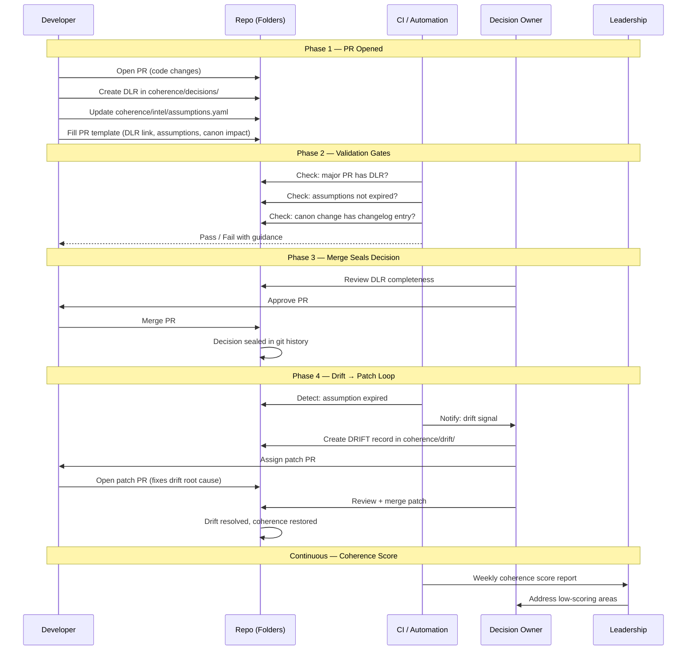

# CoherenceOps Swim Lane

End-to-end flow from PR to drift resolution.

## Reading the Diagram

- **Left to right** = increasing authority
- **Top to bottom** = time progression through 4 phases
- **Solid arrows** = actions taken
- **Dashed arrows** = automated feedback
- The loop repeats: decide, seal, detect drift, patch
